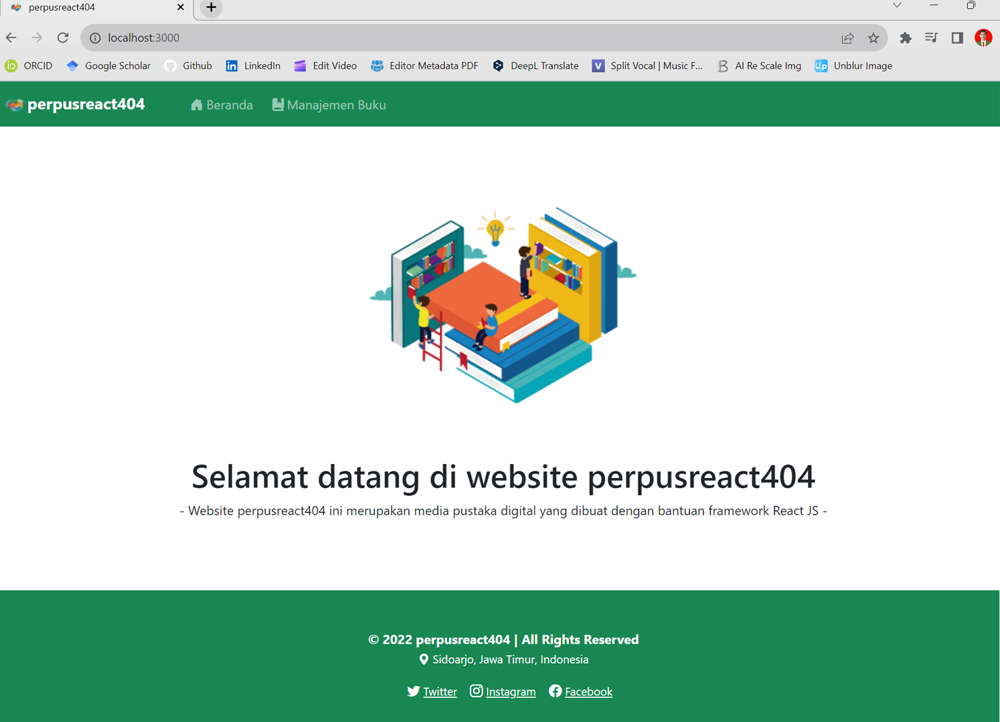
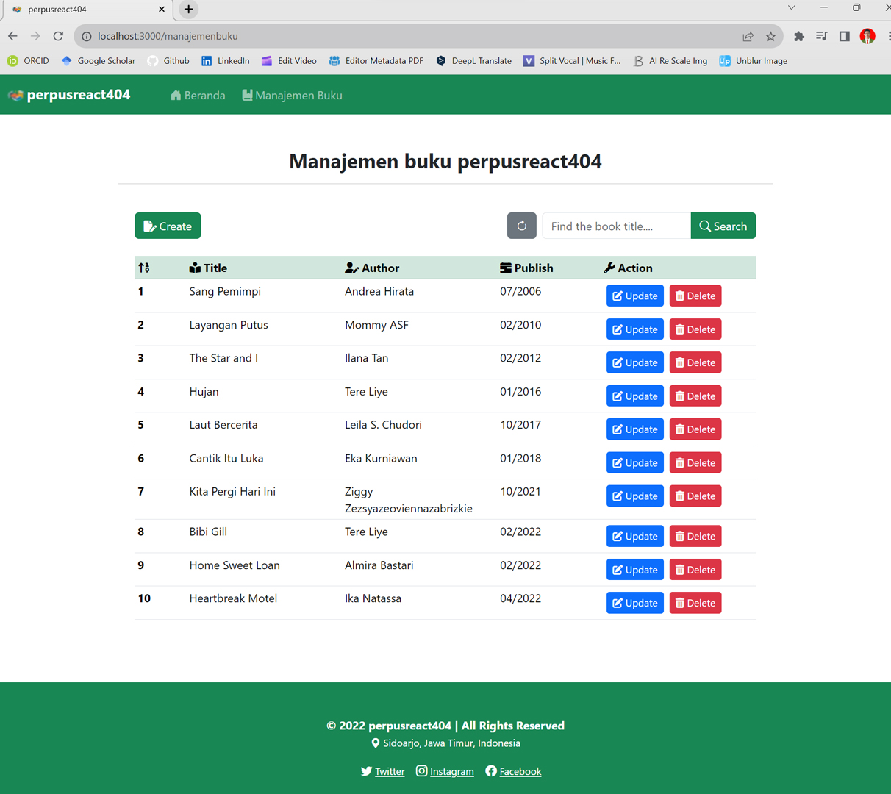
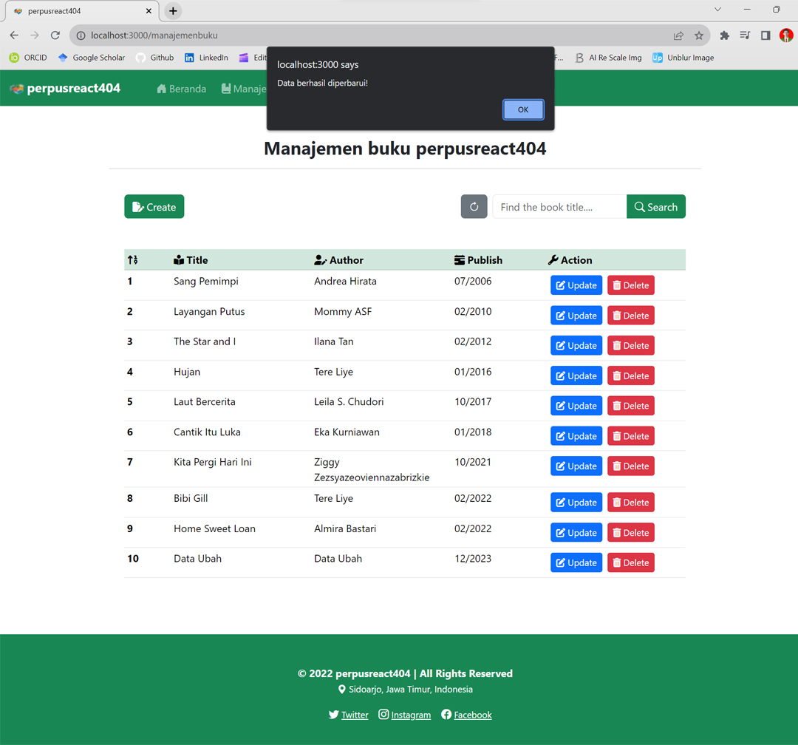
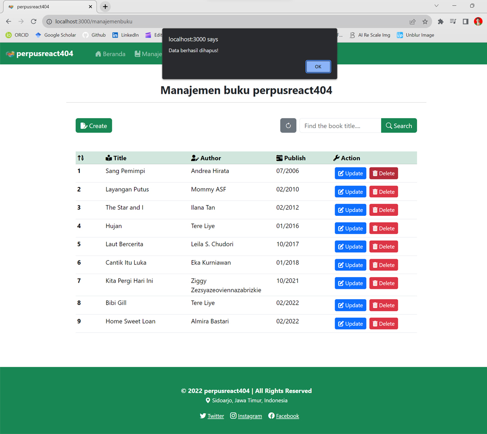
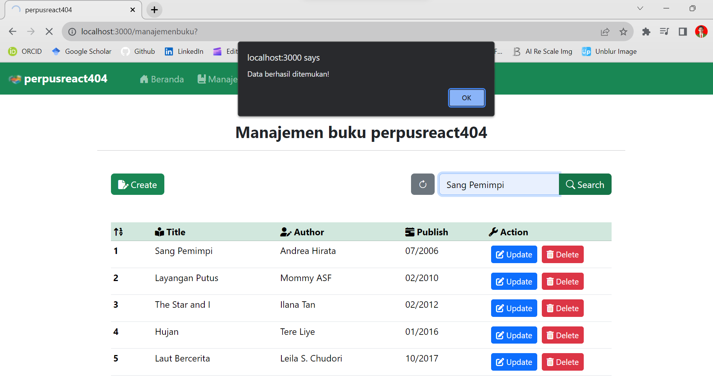

[](https://github.com/ellerbrock/open-source-badges/)
[](https://opensource.org/licenses/MIT)


# PerpusReact404
<p>PerpusReact404 adalah hasil dari pelatihan reguler CAMP404 Batch 16 yang telah saya sesuaikan.</p>

<br><br>

## Kebutuhan Proyek
| Bagian |	Deskripsi |
| --- | --- |
| Fitur | Buat, Baca, Perbarui, Hapus, ETC |
| Kerangka Kerja | Express; React (Mongoose, Cors, Morgan); Bootstrap 5 |
| Peralatan | Visual Studio Code, MongoDB, Node.Js |

<br><br>

## Unduh & Instal
1. Visual Studio Code

   <table><tr><td width="810">
   
   ```
   https://bit.ly/VScode_Installer
   ```

   </td></tr></table><br>
   
2. NodeJS

   <table><tr><td width="810">
   
   ```
   https://bit.ly/NodeJS_Installer
   ```

   </td></tr></table><br>
   
3. MongoDB

   <table><tr><td width="810">
      
   ```
   https://bit.ly/MongoDB_Installer
   ```

   </td></tr></table><br>
   
4. Visual Studio Code Extensions

   <table><tr><td width="810">

   ``` Prettier ```   

   </td></tr></table>

<br><br>

## Basis Data
1. Buatlah ``` koneksi ``` di ``` MongoDB ``` seperti yang ditunjukkan pada gambar berikut:
   
   <table><tr><td width="810">   
      
   </td></tr></table><br>

2. Buatlah ``` database ``` dan ``` koleksi ``` seperti yang ditunjukkan pada gambar di bawah ini:
   
   <table><tr><td width="810">
      
   </td></tr></table><br>

3. ``` Add Data ``` -> ``` Import JSON or CSV File ``` -> Cari berkas yang bernama ``` db_perpusreact404.katalogbuku.json ```, berkas ini terletak di direktori ``` perpusreact404/public/DB ```.<br>

   <table><tr><td width="810">
      
   </td></tr></table><br>

4. Buka direktori ``` backend ``` -> Buka ``` CMD ``` di dalam direktori tersebut -> Ketik seperti di bawah ini:

   <table><tr><td width="810">

   ````bash
   npx nodemon server.js
   ````

    

   </td></tr></table>

<br><br>

## Memulai
1. Unduh dan ekstrak repositori ini.<br><br>
   
2. Buka direktori ``` perpusreact404 ```, lalu buka ``` CMD ``` di dalam direktori tersebut. Untuk memulai ``` server web ```, anda harus mengetikkan perintah berikut:

   <table><tr><td width="810">

   ````bash
   npm start
   ````

      

   </td></tr></table><br>

3. Silakan akses fitur-fitur tersebut dan nikmatilah [Selesai].

<br><br>

## Sorotan
<table>
<tr>
<th width="840">Beranda</th>
</tr>
<tr>
<td></td>
</tr>
</table>
<table>
<tr>
<th width="210">Buat</th>
<th width="210">Baca</th>
<th width="210">Perbarui</th>
<th width="210">Hapus</th>
</tr>
<tr>
<td></td>
<td></td>
<td></td>
<td></td>
</tr>
</table>
<table>
<tr>
<th width="840">Pencarian</th>
</tr>
<tr>
<td></td>
</tr>
</table>

<br><br>

## Pengingat
Kekurangan: Masih ada bug di bagian pencarian data.

<br><br>

## Apresiasi
Jika karya ini bermanfaat bagi anda, maka dukunglah karya ini sebagai bentuk apresiasi kepada penulis dengan mengklik tombol ``` ⭐Bintang ``` di bagian atas repositori.

<br><br>

## Penafian
Aplikasi ini merupakan hasil karya saya sendiri dan bukan merupakan hasil plagiat dari penelitian atau karya orang lain, kecuali yang berkaitan dengan layanan pihak ketiga yang meliputi: pustaka, kerangka kerja, dan lain sebagainya.

<br><br>

## LISENSI
LISENSI MIT - Hak Cipta © 2022 - Devan C. M. Wijaya, S.Kom

Dengan ini diberikan izin tanpa biaya kepada siapa pun yang mendapatkan salinan perangkat lunak ini dan file dokumentasi terkait perangkat lunak untuk menggunakannya tanpa batasan, termasuk namun tidak terbatas pada hak untuk menggunakan, menyalin, memodifikasi, menggabungkan, mempublikasikan, mendistribusikan, mensublisensikan, dan/atau menjual salinan Perangkat Lunak ini, dan mengizinkan orang yang menerima Perangkat Lunak ini untuk dilengkapi dengan persyaratan berikut:

Pemberitahuan hak cipta di atas dan pemberitahuan izin ini harus menyertai semua salinan atau bagian penting dari Perangkat Lunak.

DALAM HAL APAPUN, PENULIS ATAU PEMEGANG HAK CIPTA DI SINI TETAP MEMILIKI HAK KEPEMILIKAN PENUH. PERANGKAT LUNAK INI DISEDIAKAN SEBAGAIMANA ADANYA, TANPA JAMINAN APAPUN, BAIK TERSURAT MAUPUN TERSIRAT, OLEH KARENA ITU JIKA TERJADI KERUSAKAN, KEHILANGAN, ATAU LAINNYA YANG TIMBUL DARI PENGGUNAAN ATAU URUSAN LAIN DALAM PERANGKAT LUNAK INI, PENULIS ATAU PEMEGANG HAK CIPTA TIDAK BERTANGGUNG JAWAB, KARENA PENGGUNAAN PERANGKAT LUNAK INI TIDAK DIPAKSAKAN SAMA SEKALI, SEHINGGA RISIKO ADALAH MILIK ANDA SENDIRI.
